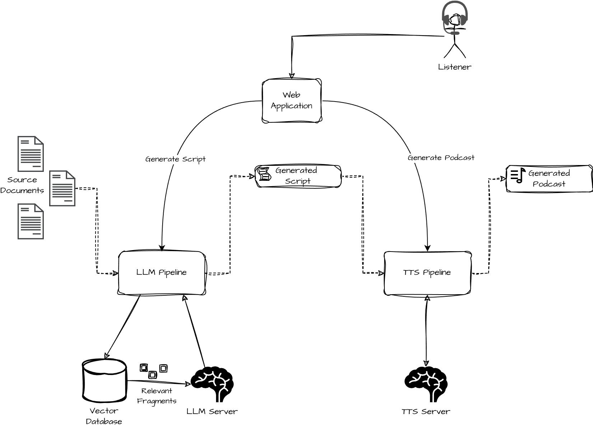

# Blog Post

Date: 09/16/24 by Dmitry Kniazev

## Intro

I came across these documents on my home NAS appliance that have been sitting there for a very, very long time. Obviously, I was not going to read them or, even open any of them: like every other parent in the world I had other things to do: pick up my kids from school, drive them home for a quick snack, drop them off for swimming classes, then drive to here, there and the rest of the universe... I drive a lot and like listening to the podcasts while driving. Hey, smart AI! - I thought, are you actually that smart to turn these documents into a podcast for me?

A few days after I joined a hackathon, because, you know, nothing motivates better than a deadline. I wanted to learn more about Gen AI and the ecosystem for building these apps.

## Architecture

I broke down the problem into two steps: **generating a script** and **generating a podcast**. I decided to use a simple UI where the listener (me) would specify their interests and first see the script generated by an LLM (Large Language Model). If it wasn't good enough, was too big or too small, I could then re-run that step or edit it manually before feeding into the next step. Generating a podcast is the second step which would involve running a TTS (Text-to-Speech) model to actually produce a human-like audio which I can download and listen on the go.



A simple [RAG](https://blogs.nvidia.com/blog/what-is-retrieval-augmented-generation/) architecture came to my mind. Usually, it is used to augment LLM with the private data, but in my case while the data was public, I still wanted to select the fragments tailored to my current interests. For example, I had a bunch of documents that looked like weekly news about Python, Rust and Java. And if I wanted to learn about Web frameworks (regardless of the language) I expected the system to only get the relevant fragments to be used for the script generation.

I decided to use [LangChain](https://www.langchain.com/) framework to implement the LLM pipeline which provides support for a variety of vector databases and models. My LLM server is a separate [Ollama](https://ollama.com/) container which I can use to serve and switch between the different models for testing their performance. The TTS pipeline uses a simple API which is exposed in the TTS server using [Fastapi](https://fastapi.tiangolo.com/) framework. TTS server also runs in a separate container serving the [Suno AI Bark](https://github.com/suno-ai/bark) text-to-speech model served using the [HuggingFace's transformers](https://huggingface.co/docs/transformers/en/index) library. Finally, the UI is implemented as a dead simple [Gradio](https://www.gradio.app/) app.

## Implementation

I typically use VS Code to develop my applications. For this hackathon organizers suggested using [NVIDIA AI Workbench](https://www.nvidia.com/en-us/deep-learning-ai/solutions/data-science/workbench/) which I explored in every detail. If you are an applications developer, like me, this tool is not a replacement for your IDE. But it will help you orchestrate your AI solution, test it locally on your machine and then reproduce your environment on a different GPU-enabled system. Most apps are packaged and delivered as container images today and the thing is, running a GPU-enabled app can be complex: from GPU drivers to container runtime, to CUDA version, to ML framework (such as pytorch or tensorflow), not to even mention your app dependencies. All these things are handled by the tool so you have more time to focus on your application implementation.

AI Workbench is installed on your dev machine and then used to connect to a GPU-enabled location, which, if you are lucky, can be your local dev machine. You can then create a new project or clone an existing one from GitHub. AI workbench will guide you to select the base image (for beginners, I highly recommend sticking to one of the NVIDIA's Python + CUDA images) and will create a project skeleton for you. When you build your project, it creates a docker image and installs all the dependencies into it. You can use **apt** and **pip** package managers to define tools and libraries needed for your project. I really wish NVIDIA supported **uv** as an option, since pip installs are probably the slowest part of the building process. Each container can host multiple components (aka apps) for your solution. For example, you can have a [Fastapi](https://fastapi.tiangolo.com/) server exposing API of your LLM and a [Gradio](https://www.gradio.app/) frontend utilizing that model through an exposed API. These will be your two apps packaged to the same project container and can be started/stopped individually.

AI Workbench can be used to orchestrate and package any AI projects, however it will really shine if you are developing for NVIDIA GPU-enabled system. It will save you a lot of time by guiding you through the process and automating things like installing the drivers, configuring the container runtime, building and running your dockerized projects and even capturing logs. The only thing to keep in mind is that you have to have access to a supported GPU system, such as **RTX** or **H100**. Unforutnately, I didn't have that in my pocket, so I tried testing it on a cheaper **Jetson Orin Nano** which at the time of writing this article is not yet supported either. I really hope NVIDIA adds support for the arm64-based Jetsons since developing embedded AI solutions looks like a great use of the tool.

## Test it out

[Coming soon]

```sh
sudo apt install direnv
```


```sh
eval "$(direnv hook bash)"
```


```sh
uv venv -p python3 .venv && source .venv/bin/activate
```

```sh
uv pip install -r requirements.txt
```
