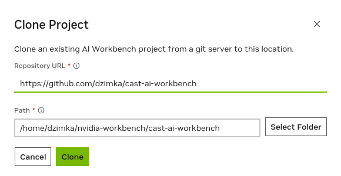
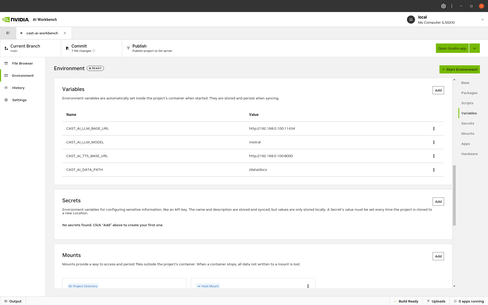

# CAST AI Workbench

This project is an application developed for the [HackAI hackathon](https://hackaichallenge.devpost.com/) using [NVIDIA AI Workbench](https://www.nvidia.com/en-us/deep-learning-ai/solutions/data-science/workbench/) tool.


## Description

Turn your documents to a podcast tailored to your interests! This application uses a RAG arhcitecture to select documents relevant to the user interests, then creates a script for the podcast using your LLM of choice and finally, generates the actual podcast audio based on the script provided.

## Getting Started

### Building

Open the AI Workbench and connect to your local location. You should see the `My Projects | local` screen where you may choose to create a new one or clone an existing one. Choose `Clone Project` and put the project GitHub link below:

```
https://github.com/dzimka/cast-ai-workbench.git
```

Optionally, change the location of the project on your machine:



After cloning the project it will open the project window and will mark it with the `Build Required` tag. Hit the `Start Build` button and wait till the build process completes.

> Note: Building the AI Workbench project will take a while (about 60 minutes on my machine). During this time the tool will download the base image, install all the project dependencies, and prepare the new `project` image.

If you see the `Build Ready` message at the bottom of the screen, we should be good to go. One other thing we need to do is to fetch the models (LLM and TTS). Go to the `Environment` tab and scroll down to the `Variables` section:



Optionally, modify the environment variables to adjust the LLM model that you want to use for **script generation**.

Next, run the `init.sh` script that will pre-fetch the LLM and TTS models and put them to the `models` folder. In the terminal window, go to the project folder and run the following command:

```bash
code/scripts/init.sh
```

> Note: This step may take a while depending on the model size you choose to use for generation.

### Running

That's it! Toggle the buttons to start **all** apps in the workbench and wait till the workbench launches the gradio app. When you see this screen below you can start experimenting with the app:


### Testing

First, you generate the script. Specify the topics of interest (you can put whatever you want in there, but the LLM is instructed to only use the documents in the [/data/docs](data/docs/) directory for the script generation task). Click on the `Generate Script` button and wait till it finishes. The output will be in the `Generated script` textbox. Review and modify it however you like it before feeding it to the next step. For experimentation, I suggest keeping it small, maybe even down to one or two sentences, because the TTS model is not able to generate audio longer than a few seconds for a single request (something that can definitely be improved later).

Next, click on the `Generate Podcast` button to call the TTS model and pass the script as an input parameter to it. This step takes about 90 seconds on my Jetson Orin Nano, so please be patient if you run it in a similar setup. Once the audio is generated you can simply use the audio component play button to play it.

Congrats! You've now used not one, but two GenAI models in a single app built with NVIDIA AI Workbench! Thanks for reading.

